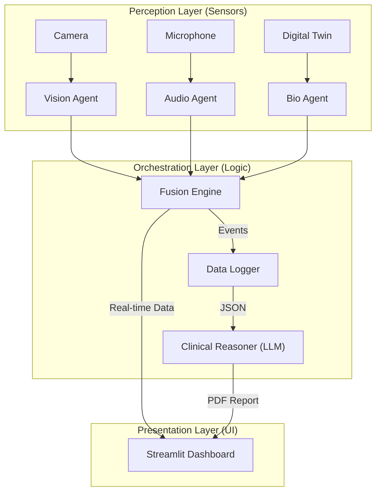

# NeuroSync Enterprise: Multimodal AI for Autism Assessment

> **A Privacy-First, Local-Edge AI System for Objective Neuro-Behavioral Analysis.**

---

## 2. Problem Statement 

**Autism Spectrum Disorder (ASD)** affects 1 in 36 children, yet the diagnosis and monitoring process remains archaic:
*   **Subjective**: Relies heavily on human observation, which varies between clinicians.
*   **Delayed**: Waitlists for assessment can exceed 12 months.
*   **invasive**: Often requires wearable sensors that cause sensory overload in sensitive patients.
*   **Data Silos**: Clinical notes are text-based and do not capture granular behavioral trends over time.

**The Need**: A non-invasive, objective, and accessible tool that empowers clinicians with real-time biometric data without compromising patient privacy.

---

## 3. Solution Overview

**NeuroSync Enterprise** is a **Local-First AI Application** that transforms a standard laptop into a clinical observation station.

It uses **Multimodal Sensor Fusion** to correlate disparate biological signals:
1.  **Computer Vision**: Tracks body mechanics (Stimming, Gait).
2.  **Audio Analysis**: Detects vocal distress (Meltdowns).
3.  **Physiological Telemetry**: Estimates Heart Rate via webcam (rPPG) or hardware sensors.

By synchronizing these data streams in real-time, NeuroSync provides a **holistic view** of a patient's regulation state, generating instant clinical reports using an on-device Small Language Model (**Phi-3**). No data ever leaves the machine.

---

## 4. Features

### **Core Capabilities**
*   **Non-Invasive Sensing**: Tracks Heart Rate and HRV using just a webcam (Remote Photoplethysmography).
*   **Behavior Recognition**: Detects Hand Flapping, Head Banging, Spinning, and Gaze Aversion using MediaPipe.
*   **Fusion Engine**: Correlates behavioral outbursts with physiological stress peaks (e.g., "Spinning triggered by High Heart Rate").
*   **Privacy-First**: Zero cloud dependency. All video and data are processed and encrypted locally (AES-256).

### **Clinical Tools**
*   **Automated Reporting**: Generates PDF medical summaries using a local LLM (Phi-3 Mini).
*   **Longitudinal Tracking**: Visualizes progress over weeks/months (e.g., "Anxiety Baseline reducing by 10%").
*   **Digital Twin Simulator**: Allows doctors to test specific scenarios without a patient present.

---

## 5. System Architecture

NeuroSync follows a **Layered Monolithic Architecture** designed for high-performance edge computing.

### **High-Level Modules**
1.  **Perception Layer**: Threaded Agents (`VisionAgent`, `AudioAgent`, `BioAgent`) that continuously poll hardware.
2.  **Orchestration Layer**: The `FusionEngine` synchronizes timestamps to find correlations.
3.  **Presentation Layer**: A responsive `Streamlit` dashboard for real-time visualization.

### **Architecture Diagram**



---

## 6. Project Structure

```text
NeuroSync/
│
├── neuroapp.py             # Application Entry Point
├── run_app.sh              # One-click Launcher (Setup + Run)
│
├── config/
│   └── settings.py         # Global Constants (Thresholds, Paths)
│
├── src/
│   ├── agents/             # Sensor Drivers (The "Senses")
│   │   ├── vision_agent.py
│   │   ├── audio_agent.py
│   │   └── bio_agent.py
│   │
│   ├── orchestration/      # Core Logic (The "Brain")
│   │   ├── fusion_engine.py    # Temporal Correlation logic
│   │   └── reasoner.py         # Phi-3 LLM Wrapper
│   │
│   ├── sensors/            # Hardware Abstraction
│   │   ├── camera.py           # OpenCV Wrapper
│   │   └── rppg.py             # Remote Heart Rate Algorithm
│   │
│   ├── ui/                 # Frontend Modules
│   │   ├── dashboard.py        # Main Live View
│   │   ├── history.py          # Trend Analysis
│   │   └── calibration.py      # Patient Baseline Tool
│   │
│   └── utils/              # Helpers
│       ├── crypto_manager.py   # AES Encryption
│       ├── patient_db.py       # Local JSON Index
│       └── pdf_generator.py    # Report Rendering
│
└── notes/                  # Detailed Architectural Documentation
```

---

## 7. Data Flow

**Example: Detecting a "Meltdown"**

1.  **Input**: User starts session. Camera buffers frames; Microphone buffers audio.
2.  **Processing**:
    *   `VisionAgent` detects repetitive motion (Spinning) > Threshold.
    *   `BioAgent` detects Heart Rate spike (120 BPM).
3.  **Fusion**: `FusionEngine` sees both events happen within a 1.0s window. It flags a **"Neuro-Behavioral Match"**.
4.  **Logging**: `DataLogger` encrypts the event and saves it to `data/patient_logs/`.
5.  **Output**: `Dashboard` updates the "Stress Meter".
6.  **Report**: On session end, `Reasoner` reads the logs and generates a PDF summary.

---

## 8. Technologies Used

*   **Language**: Python 3.10+
*   **Interface**: Streamlit (Reactive Web Framework)
*   **Computer Vision**: MediaPipe Holistic, OpenCV
*   **AI / GenAI**: Llama.cpp (Phi-3 Mini Quantized), Scikit-Learn (Signal Processing)
*   **Visualization**: Plotly Interactive Charts
*   **Security**: Cryptography (Fernet/AES)

---

## 9. How to Run the Project

### **Prerequisites**
*   **OS**: Linux (Ubuntu 20.04+) or macOS.
*   **Hardware**: Webcam required. 8GB+ RAM recommended.

### **Installation & Execution**

```bash
# 1. Clone the repository
git clone https://github.com/your-username/neurosync.git
cd neurosync

# 2. Run the One-Click Launcher
# This script automatically creates a venv, installs dependencies, and launches the app.
chmod +x run_app.sh
./run_app.sh
```

### **Manual Setup (If script fails)**

```bash
python3 -m venv venv
source venv/bin/activate
pip install -r requirements.txt
streamlit run neuroapp.py
```

---

## 10. Configuration

Global settings are managed in `config/settings.py`.

*   **`AUDIO.SCREAM_THRESH`**: Sensitivity for audio distress detection.
*   **`VIDEO.SPIN_THRESH`**: Velocity threshold for detecting spinning.
*   **`MODEL.PHI3_PATH`**: Path to the local LLM weights (`.gguf`).

> **Note**: System paths and Hardware IDs (Camera Index) can also be tweaked here.

---

## 11. Future Roadmap Summary

*See `notes/FUTURE_ROADMAP.md` for details.*

*   **Short-Term**: Architecture refactoring (remove monolithic UI loop), SQLite integration.
*   **Medium-Term**: Docker containerization, MLflow experiment tracking.
*   **Long-Term**: Federated Learning for privacy-preserving model updates.

---

## 12. Limitations

1.  **Single Thread Blocking**: Generating the AI Report blocks the UI for 5-10 seconds on CPUs.
2.  **Lighting Sensitivity**: The rPPG heart rate sensor requires good lighting to work accurately.
3.  **Hardware Bound**: Running Vision + Audio + LLM simultaneously requires a decent CPU (i5/i7 or M1+).

---

## 13. Future Improvements

*   **GPU Acceleration**: Migrate Vision and LLM inference to CUDA/MPS.
*   **Mobile App**: React Native companion app for parents to record home videos.
*   **API Layer**: Refactor core logic into FastAPI to support remote clients.

---

## 14. Learning Outcomes

This project demonstrates advanced engineering discrepancies:
*   **Systems Design**: Building a complex, multi-threaded real-time system in Python.
*   **Applied AI**: Implementing Logic-based AI (Fusion) alongside Generative AI (LLMs).
*   **Privacy Engineering**: Designing strictly for offline, encrypted capability (HIPAA).
*   **Product Engineering**: Moving from "Jupyter Notebook code" to a deployed Application.

---

## 15. Deployment Vision

Currently, **NeuroSync** is a standalone **"Medical Device Software"** (SaMD).
Future evolution targets a **SaaS Model**:
*   **Edge**: Tablets collect data in clinics.
*   **Cloud**: Aggregated anonymized statistics for research (Federated Learning).
*   **Integration**: HL7/FHIR export to hospital EHR systems.

---


---
*©NeuroSync Enterprise. Open Source for Research Use.*
