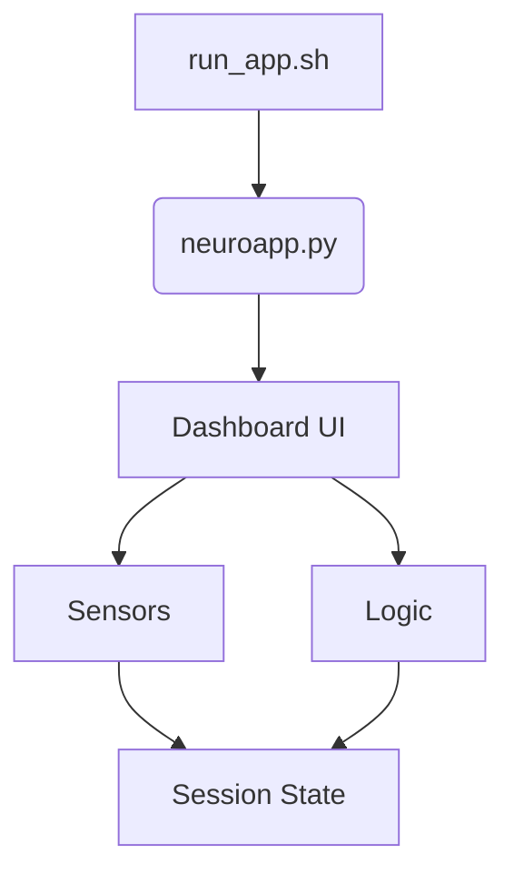

# FUTURE ROADMAP: NeuroSync Enterprise

**Document Version:** 1.0
**Date:** 2026-02-20
**Status:** DRAFT
**Author:** Lead Systems Architect

---

## 1. 🏁 Current Stage Assessment

### **Phase: Advanced Prototype / Pre-MVP**
The project successfully demonstrates the core value proposition: **Multimodal AI for Autism Assessment** running entirely offline. It connects real sensors (Webcam, Mic) to a logic engine (Fusion) and generates clinical reports (LLM).

### **Strengths**
1.  **Privacy-First Architecture:** innovative "Local-First" design using `PatientDB` and `CryptoManager` ensures HIPAA compliance without complex cloud infrastructure.
2.  **Multimodal Fusion:** The `FusionEngine` correctly implements a temporal sliding window to correlate disparate signals (Vision + Bio), which is a significant competitive advantage over single-modality apps.
3.  **Rapid Prototyping Speed:** Streamlit allows for extremely fast iteration of UI and Data Science logic in a single language (Python).

### **Weaknesses (Technical Debt)**
1.  **Monolithic UI Loop:** `dashboard.py` contains the reception, processing, logic, and rendering code in a single `while` loop. This is fragile and hard to test.
2.  **Blocking Operations:** The LLM generation (`reasoner.analyze_session`) blocks the main thread, freezing the UI for 10-20 seconds.
3.  **Resource Contention:** Running MediaPipe (CV), Audio Analysis, and Phi-3 (LLM) on a single CPU resource contends for Global Interpreter Lock (GIL) and memory.
4.  **Fragile Persistence:** Relying on JSON files (`patient_db.json`) is prone to corruption if the app crashes mid-write.

### **Production Readiness Score: 4/10**
It is ready for **Controlled Pilot Testing** (supervised by engineers), but **NOT** ready for mass deployment to non-technical clinicians.

---

## 2. 🗓️ Short-Term Roadmap (0–3 Months)
**Goal:** harden the prototype into a Stable MVP (Minimum Viable Product).

### **A. Refactoring & Stability**
-   **[Critical] Decouple Logic from UI**: Move the `process_frame` loops out of `dashboard.py` and into a `SessionManager` class in `src/orchestration`. The UI should only *display* state, not *calculate* it.
-   **[Critical] Async LLM**: Move `ClinicalReasoner` to a background thread or separate process so the UI doesn't freeze during report generation.
-   **[High] Database Upgrade**: Replace `patient_db.json` with **SQLite**. This provides ACID guarantees (no data corruption) and allows SQL queries for trend analysis.

### **B. Testing Framework**
-   **Unit Tests**: Add `pytest` coverage for `FusionEngine` and `BioAgent`. Currently, we rely on manual "Simulation Mode" for verification.
-   **Integration Tests**: Scripted runs that simulate a 10-minute session and verify the PDF output matches expected values.

### **C. Error Handling**
-   **Graceful Degradation**: If the Camera disconnects mid-session, the app currently may crash the loop. Implement auto-reconnect logic in `CameraSensor`.

---

## 3. 🖥️ UI / Application Layer Decision

### **The Dilemma**
We are building a **High-Compute Local Application**, not a simple CRUD website.

| Architecture | Suitability | Pros | Cons |
| :--- | :--- | :--- | :--- |
| **Streamlit (Current)** | **High for Pilot** | Fast dev speed, native Python support, built-in widgets. | Hard to style custom layouts, single-threaded, re-runs script continuously. |
| **FastAPI + React** | **High for SaaS** | Industry standard, complete control over UI, scalable. | High complexity. Requires separating the "AI Engine" from the UI. Communication via WebSockets. |
| **Electron + Python** | **Best for Desktop** | Native "App" feel, access to local hardware (USB/CAM) is easier. | Heavy build process. |

### **Recommendation: Hybrid Approach**
**Do NOT rewrite in React yet.**
For the next 6 months (Clinical Pilot Phase), the target hardware is a **High-Spec Laptop** given to the doctor.
1.  **Keep Streamlit** for the Interface. It communicates efficiently with the local Python backend.
2.  **Optimize Streamlit**: Use `st.fragment` (new feature) to only re-run specific parts of the UI, improving performance.
3.  **Future (Post-Pilot)**: If we move to a Tablet/Mobile version, we **MUST** switch to **FastAPI + React Native**. Streamlit cannot run natively on iPad.

---

## 4. 🚀 Medium-Term Roadmap (3–6 Months)
**Goal**: Prepare for Scale and Remote Deployment.

### **A. Containerization (Docker)**
-   Create a `Dockerfile` that bundles:
    -   System Dependencies (`libGL` for OpenCV, `PortAudio`).
    -   The specific Python Environment.
    -   The Models (`Phi-3`).
-   **Why**: Solves "It works on my machine" issues. Doctors can receive a Docker Image update instead of running `git pull`.

### **B. Update System**
-   Implement a mechanism to check for updates (fetch new code/models) securely.

### **C. Experiment Tracking**
-   Integrate **MLflow**.
-   **Why**: We need to know if "Model V2.0" is actually better than V1.0. Log detection confidence and false positives from pilot sessions.

---

## 5. 🔮 Long-Term Roadmap (6–12 Months)
**Goal**: Enterprise Ecosystem.

### **A. Federated Learning**
-   **Concept**: Train the model on patient data *locally* on the laptop, then send only the *weight updates* (not the video) to the cloud.
-   **Why**: Improves the AI without violating privacy.

### **B. Cloud Sync (Optional)**
-   Build a secure **HITECH-compliant Cloud Vault**.
-   Allow doctors to "Sync" anonymized reports for backup.

### **C. Mobile Companion App**
-   Build a lightweight **React Native** app for Parents to record videos at home and upload them to the Doctor's system for analysis.

---

## 6. 🛠️ Deployment Strategy

### **Step 1: The "Box" (Current)**
-   **Hardware**: Validation on NVIDIA Jetson or Gaming Laptop.
-   **Software**: Pre-installed `venv`. Run via `run_app.sh`.
-   **Update**: Manual (Git).

### **Step 2: The "Container" (Month 4)**
-   **Distribution**: Docker Compose file.
-   **Command**: `docker-compose up -d`.
-   **Benefit**: Guaranteed environment consistency.

### **Step 3: The "SaaS" (Year 1+)**
-   **Only relevant if** we move processing to the cloud (Expensive GPU costs).
-   **Hardware**: Client uses iPad.
-   **Backend**: GPU Cluster (AWS G5 instances) running the Inference API.

---

## 7. 🏗️ Architecture Evolution Plan

### **Phase 1: Monolithic Script (Current)**


### **Phase 2: Modular Service (Target)**
*Decouple the "Brain" from the "Face".*
```mermaid
graph TD
    A[Entry Point] --> B[UI Layer (Streamlit)]
    A --> C[Engine Layer (Python Process)]
    B -- Queue/Socket --> C
    C --> D[Sensors] & E[Models]
    C -- Results --> B
```

---

## 8. 🎯 Final Recommendation

**Build for Stability, Not Hype.**

1.  **Do NOT switch to FastAPI/React yet.** The complexity cost is too high for the current team size. Streamlit is sufficient for a laptop-based medical device.
2.  **Focus on the "Engine"**: Refactor `dashboard.py` to extract the `run_session()` logic into a pure Python class `src/orchestration/SessionManager`. This makes the code testable and prepares it for an eventual API migration.
3.  **Upgrade Storage**: Move `patient_db.json` to SQLite immediately. Data integrity is paramount in medical apps.
4.  **Hardware**: Standardize the laptop spec (e.g., "Must have 16GB RAM"). Do not try to optimize for Raspberry Pi just yet; focus on accuracy first.

**Immediate Next Step**: Create `src/orchestration/session_manager.py` and move the `while` loop logic there.
