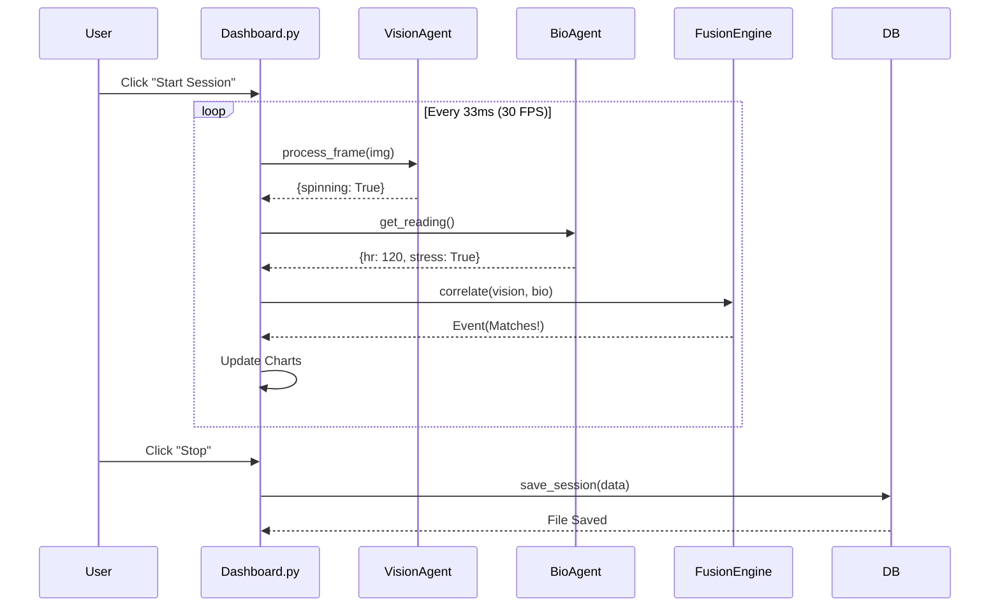

# PROJECT ARCHITECTURE & FLOW: NeuroSync Enterprise

**Document Version:** 2.1
**Date:** 2026-02-20
**Module:** System Core
**Author:** Lead Systems Architect

---

## 1. 🏗️ High-Level Architecture

The NeuroSync system follows a **Layered Monolithic Architecture** with an emphasis on **Multimodal Sensor Fusion**. It is designed as a local-first, privacy-compliant application where all processing happens on the edge (the user's machine).

### **The Three Layers**

1.  **Presentation Layer (UI)**
    -   **Technology**: Streamlit (Python-based Web Framework).
    -   **Role**: Handles user interaction (Start/Stop), visualization (charts), and video rendering.
    -   **Key Files**: `neuroapp.py`, `src/ui/*.py`.

2.  **Orchestration Layer (Logic)**
    -   **Technology**: Python Threads & queues.
    -   **Role**: Synchronizes data streams, runs the fusion algorithm, and manages session state.
    -   **Key Files**: `fusion_engine.py`, `reasoner.py`, `session_manager.py` (planned).

3.  **Perception Layer (Sensors)**
    -   **Technology**: OpenCV, MediaPipe, PyAudio, LSL.
    -   **Role**: Raw data acquisition and feature extraction.
    -   **Key Files**: `vision_agent.py`, `audio_agent.py`, `bio_agent.py`.

### **Architecture Diagram**

```mermaid
graph TD
    subgraph "Presentation Layer"
        UI[Streamlit Dashboard]
        Render[Video Renderer]
        Charts[Plotly Charts]
    end

    subgraph "Orchestration Layer"
        Fusion[Fusion Engine]
        Log[Data Logger]
        LLM[Clinical Reasoner (Phi-3)]
    end

    subgraph "Perception Layer"
        Cam[Camera Buffer] --> Vision[Vision Agent (MediaPipe)]
        Mic[Mic Buffer] --> Audio[Audio Agent (Numpy)]
        Bio[Bio Buffer] --> Twin[Bio Agent (Simulator/LSL)]
    end

    UI -->|Start/Stop| Fusion
    Vision -->|Behavior Tags| Fusion
    Audio -->|Volume/Scream| Fusion
    Twin -->|HR/EEG Data| Fusion

    Fusion -->|Correlated Events| Log
    Log -->|JSON Session| LLM
    LLM -->|Text Report| UI
```

---

## 2. 🔗 File-Level Connection Mapping

This section maps the **Dependency Graph** of every file in the project.

### **Root Level**

-   **`neuroapp.py`** (Entry Point)
    -   *Imports*: `config.settings`, `src.ui.*`, `src.agents.*`, `src.orchestration.*`.
    -   *Why*: Initializes the global Singletons (Agents) and routes the user to the correct UI page.
    -   *Called By*: `run_app.sh` (via `streamlit run`).

### **Config Layer**

-   **`config/settings.py`**
    -   *Imports*: `os`, `pydantic` (implicit via dataclasses).
    -   *Why*: Defines global constants (Paths, Thresholds, Model Params).
    -   *Imported By*: Almost every file in `src/`.

### **Agents (Perception)**

-   **`src/agents/vision_agent.py`**
    -   *Imports*: `mediapipe`, `cv2`, `config.settings`.
    -   *Why*: Calculating limb vectors.
    -   *Imported By*: `neuroapp.py` (Init), `src/ui/dashboard.py` (Execution).

-   **`src/agents/audio_agent.py`**
    -   *Imports*: `sounddevice`, `numpy`, `queue`.
    -   *Why*: Threaded audio capture.
    -   *Imported By*: `neuroapp.py`.

-   **`src/agents/bio_agent.py`**
    -   *Imports*: `pylsl`, `src.sensors.rppg`.
    -   *Why*: Abstracting hardware vs. simulation.
    -   *Imported By*: `neuroapp.py`.

### **UI Layer**

-   **`src/ui/dashboard.py`**
    -   *Imports*: `cv2`, `streamlit`, `src.utils.logger`.
    -   *Why*: The main "While Loop" that runs the session.
    -   *Imported By*: `neuroapp.py`.

-   **`src/ui/history.py`**
    -   *Imports*: `src.utils.patient_db`, `plotly`.
    -   *Why*: Visualizing longitudinal data.
    -   *Imported By*: `neuroapp.py`.

### **Orchestration**

-   **`src/orchestration/fusion_engine.py`**
    -   *Imports*: `time`, `src.utils.logger`.
    -   *Why*: Correlating `Vision` + `Bio` timestamps.
    -   *Imported By*: `neuroapp.py`.

-   **`src/orchestration/reasoner.py`**
    -   *Imports*: `llama_cpp`, `src.utils.logger`.
    -   *Why*: Generating text summaries.
    -   *Imported By*: `neuroapp.py`.

### **Utilities**

-   **`src/utils/data_logger.py`**
    -   *Imports*: `crypto_manager` (Security), `patient_db` (Index).
    -   *Why*: Saving/Loading sessions.
    -   *Imported By*: `neuroapp.py`.

---

## 3. 🌊 Data Flow End-to-End

**Scenario**: A patient "spins" in their chair, triggering a "Meltdown" alert.

### **Step 1: Ingestion (t=0ms)**
-   **Camera**: Captures Frame #105 (BGR Array).
-   **Microphone**: Captures Audio Chunk (Float Array).
-   **Bio-Sensor**: Generates `{'hr': 115, 'stress': True}`.

### **Step 2: Perception (t+10ms)**
-   **VisionAgent**:
    -   Runs `mp_holistic.process(frame)`.
    -   Detects: `nose_velocity > 50`.
    -   Output: `{'spinning': True, 'hand_flapping': False}`.
-   **AudioAgent**:
    -   Calculates RMS amplitude.
    -   Output: `{'volume': 0.8, 'is_scream': True}`.

### **Step 3: Orchestration (t+15ms)**
-   **Dashboard Loop**: Collects outputs from Agents.
-   **FusionEngine**:
    -   Receives `spinning=True`.
    -   Checks buffer: `last_bio_stress_time` was 0.5s ago.
    -   **Decision**: `Spinning` + `High HR` = **CONFIRMED EVENT**.

### **Step 4: Presentation (t+30ms)**
-   **UI**:
    -   Draws a **RED BOX** around the face.
    -   Updates the `Events Detected: 1` counter.
    -   Adds a log entry: `[12:00:01] Spinning correlated with Stress`.

### **Step 5: Persistence (Session End)**
-   **User**: Clicks "Stop".
-   **DataLogger**:
    -   Bundles all events + bio logs into a Dictionary.
    -   Calls `CryptoManager.encrypt()`.
    -   Saves `ANON_123.enc`.
    -   Updates `patient_db.json` index.

### **Step 6: Reasoning (Post-Processing)**
-   **ClinicalReasoner**:
    -   Reads the session summary.
    -   Prompts Phi-3: "Summarize this session for a doctor."
    -   Generates: "Patient exhibited vestibular stimming..."
    -   Saves PDF.

---

## 4. ⚡ Execution Flow

When you run `./run_app.sh`:

1.  **Boot**: Shell script activates `venv` and runs `streamlit run neuroapp.py`.
2.  **Init**: `neuroapp.py` executes from top to bottom.
    -   Loads `settings`.
    -   Initializes Global Singletons (`@st.cache_resource`).
        -   `VisionAgent` (Loads MediaPipe model - 200ms).
        -   `Reasoner` (Loads Phi-3 GGUF - 5000ms).
3.  **Route**: Checks `st.sidebar`.
    -   Default: `Dashboard`.
4.  **Render**: Calls `render_dashboard()`.
    -   Enters `while cam.running:` loop.
    -   Updates UI at ~30 FPS (dependent on CPU).

---

## 5. 🎛️ Control Flow Diagram



---

## 6. ⚠️ Dependency Risk Areas

### **1. The "God Loop" in `dashboard.py`**
-   **Risk**: The main UI file handles *everything* (Vision, Audio, Bio, Logic, Rendering).
-   **Why**: Quick prototyping.
-   **Danger**: Changing one line of UI code can break the fusion logic.
-   **Fix**: Extract logic to `SessionManager`.

### **2. Global State (`st.session_state`)**
-   **Risk**: We use Streamlit's session state as a global variable store for `frames`, `bio_data`, `events`, etc.
-   **Danger**: Hard to debug race conditions. If the user refreshes the page, state might be partially lost or duplicated.

### **3. Blocking LLM Calls**
-   **Risk**: `reasoner.analyze_session` runs on the main thread.
-   **Danger**: The entire UI freezes while the "Brain" is thinking. The user might think the app crashed.
-   **Fix**: Use `threading` or `asyncio`.

---

## 7. 🚧 Scalability Bottlenecks

### **1. CPU Bound**
-   **Issue**: MediaPipe + Audio + Logic + Rendering = 90% CPU Usage.
-   **Limit**: Cannot add more advanced models (e.g., Facial Emotion Recognition) without dropping FPS.
-   **Solution**: Move Vision to GPU (CUDA/MPS) if available.

### **2. File System I/O**
-   **Issue**: `patient_db.json` is a single file.
-   **Limit**: If we have 10,000 patients, reading/writing this file will verify slow.
-   **Solution**: SQLite.

---

## 8. 💡 Refactoring Suggestions (Staff Engineer View)

If I were reviewing this PR at Google/Meta:

1.  **Inversion of Control**: The Agents currently "push" data to the Dashboard. Better: The Dashboard should subscribe to an `EventBus`.
2.  **Strict Typing**: Add `mypy` checks. Use `pydantic` models for all data packets (not just Dictionaries).
3.  **Config Injection**: Do not import `settings` directly in low-level classes. Pass configuration in `__init__`.
4.  **Logging**: Replace `print` with structured JSON logging for observability.

---
**End of Project Architecture Document**
